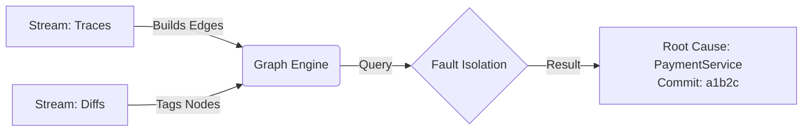

RootScout is an agentic system that automates the "investigation phase" of incident response. While standard tools (PagerDuty) only notify humans, and generic AIOps tools simply correlate metric spikes, RootScout acts as an "AI Engineer." It ingests telemetry (metrics, traces) and code changes (GitHub PRs) to build a real-time Causal Dependency Graph.
When an alert fires, the system:
- **Deductively Isolates:** Traverses the trace graph to mathematically pinpoint the failing node (e.g., "Service A is healthy, but waiting on Service B").
Agentic Investigation: A code-aware LLM agent then "logs into" that specific node, retrieves recent commits/logs, and formulates a hypothesis (e.g., "Latency spike matches the timestamp of the v2.1 deployment").
- **Resolution:** It generates a human-readable "Incident Brief" with the exact root cause and suggested rollback.
- **Stretch Goal:** A proactive "Auditor" module that analyzes historical alert patterns to identify "noisy" monitors and predict resource saturation (e.g., memory leaks) before outages occur.


# RootScout: Graph Builder and LLM agent Prototype 🕵️‍♂️

> **Project:** RootScout - Autonomous SRE Agent
> **Component:** Core Graph Engine + LLM agent (Week 1-2 Prototype)

This directory contains the **Minimum Viable Prototype (MVP)** for the RootScout Graph Engine and LLM agent. It demonstrates the core logic of the "AI SRE": combining **Telemetry (Traces)** with **Code Changes (Diffs)** to isolate root causes deterministically.

---

## 1. The Core Intuition: "The Detective & The Blueprint"

To understand what this prototype does, think of a burning building:

* **The Problem:** A fire alarm goes off (Alert), but the building has 50 rooms.
* **The "Old" Way:** A detective (AI) runs into every single room to find the fire. This is slow, and they might get lost.
* **The RootScout Way:**
    1. **The Blueprint (The Graph):** Before entering, the detective looks at a blueprint. It shows the alarm tripped in the Kitchen, but the gas pipe feeding the Kitchen comes from the Basement.
    2. **The Investigation:** The detective ignores the Bedrooms and Attic. They go straight to the **Basement** to check the pipes.

### Architecture Flow

This prototype implements the following logic flow:



## How to run (ensure you have python installed):

1. cd graph
2. pip install networkx
3. python run_simulation.py

## Expected output:

```
--- STREAMING DATA START ---
[Graph] Updated dependency: frontend -> checkout_service
[Graph] Tagged payment_service with commit a1b2c3d_bad_commit
[Graph] Updated dependency: checkout_service -> payment_service
--- STREAMING FINISHED ---

🚨 ALERT received on: frontend
🔍 Querying Graph for dependencies...
   Downstream Services: ['checkout_service', 'payment_service']

🕵️‍♀️ Fault Isolation Module Running...
   Checking checkout_service (Version: unknown)... Status: OK
   Checking payment_service (Version: a1b2c3d_bad_commit)... Status: ERROR

👉 ROOT CAUSE FOUND: payment_service
   Suspicious Commit: a1b2c3d_bad_commit
   Action: Recommended rollback of this commit.
```
