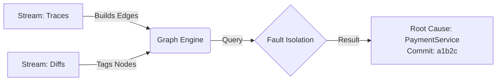

RootScout is an agentic system that automates the "investigation phase" of incident response. While standard tools (PagerDuty) only notify humans, and generic AIOps tools simply correlate metric spikes, RootScout acts as an "AI Engineer." It ingests telemetry (metrics, traces) and code changes (GitHub PRs) to build a real-time Causal Dependency Graph.
When an alert fires, the system:
- **Deductively Isolates:** Traverses the trace graph to mathematically pinpoint the failing node (e.g., "Service A is healthy, but waiting on Service B").
Agentic Investigation: A code-aware LLM agent then "logs into" that specific node, retrieves recent commits/logs, and formulates a hypothesis (e.g., "Latency spike matches the timestamp of the v2.1 deployment").
- **Resolution:** It generates a human-readable "Incident Brief" with the exact root cause and suggested rollback.
- **Stretch Goal:** A proactive "Auditor" module that analyzes historical alert patterns to identify "noisy" monitors and predict resource saturation (e.g., memory leaks) before outages occur.


# RootScout: Graph-Augmented RCA Agent 🕵️‍♂️

> **Project:** RootScout — Autonomous SRE Agent  
> **Component:** Causal Graph Engine + LLM Reasoning Layer (MVP)

RootScout is an agentic system designed to automate the high-toil "investigation phase" of incident response. While traditional tools like PagerDuty simply notify humans, and legacy AIOps tools merely correlate metric spikes, **RootScout acts as an AI SRE**. By ingesting real-time telemetry (traces) and version control data (GitHub PRs), it builds a **Causal Dependency Graph** to identify "Patient Zero" with deterministic precision.

---

## 1. The Core Intuition: "The Blueprint & The Detective"

In a complex distributed system, an alert in one service is often just a symptom of a failure elsewhere.

### The Problem
A fire alarm (Alert) goes off, but in a skyscraper with 50 floors, finding the source is slow.

### The RootScout Way
1. **The Blueprint (The Graph):** RootScout maintains a live "blueprint" of how services talk to each other. If the Kitchen alarm trips, but the gas line comes from the Basement, RootScout knows where to look first.
2. **The Investigation:** The agent ignores the Attic and Bedrooms. It zooms into the Basement (the dependency), retrieves the latest "maintenance logs" (GitHub Diffs), and identifies exactly which pipe (Commit) broke.

### Architecture Flow



---

## 2. Technical Architecture

When an alert fires, the system executes a three-stage recovery pipeline:

1. **Deductive Isolation:** The `GraphBuilder` traverses the OTel trace graph to mathematically pinpoint the failing leaf node (e.g., "Service A is healthy, but waiting on Service B").

2. **Agentic Investigation:** A code-aware LLM agent (powered by Gemini 2.5 Flash) "logs into" the suspect node, analyzes recent logs/commits, and formulates a technical hypothesis.

3. **Resolution:** The agent generates a human-readable Incident Brief including the specific root cause and a suggested remediation command (e.g., `git revert` or `kubectl rollout undo`).

---

## 3. Getting Started

### Prerequisites

- Python 3.9+
- Gemini Developer API Key: Obtain one from [Google AI Studio](https://aistudio.google.com/)

### Setup & Configuration

1. **Clone the repository** and navigate to the project root:
   ```bash
   git clone <repository-url>
   cd rootscout
   ```

2. **Install dependencies:**
   ```bash
   pip install networkx google-genai python-dotenv
   ```

3. **Configure Environment:** Create a `.env` file in the root directory and add your API key:
   ```bash
   # .env
   GEMINI_API_KEY=your_gemini_api_key_here
   GITHUB_OUTPUT_PATH=github-export-path
   GITHUB_TOKEN=                 # optional for public repo; add token if you hit rate limits
   GITHUB_WEBHOOK_SECRET=webhook-secret

   WATCH_REPO_OWNER=asthamohta
   WATCH_REPO_NAME=CS224G-SRE
   WATCH_PATH_PREFIX=online_boutique

   HOST=0.0.0.0
   PORT=8000
   ```
### Run the github PR ingester
```bash
pip3 install -r RootScout/requirements.txt  
touch RootScout/__init__.py
python3 -m RootScout.main
```
### Run the Simulation

Execute the core simulation to see the graph-building and LLM reasoning in action:

```bash
cd graph
python run_simulation.py
```

---

## 4. Expected Output

The simulation will stream trace data, identify the bottleneck, and trigger the Gemini-powered agent to provide a fix:

```plaintext
--- LLM SETUP ---
🔌 Connecting to Gemini API (2.5 Flash)...

--- STREAMING DATA START ---
[Graph] Updated dependency: frontend -> checkout_service
[Graph] Tagged payment_service with commit a1b2c3d_bad_commit
[Graph] Updated dependency: checkout_service -> payment_service
--- STREAMING FINISHED ---

🚨 ALERT received on: frontend
🔍 Retrieving Context Packet...

📡 Sending request to gemini-2.5-flash...

📋 FINAL INCIDENT REPORT
{
  "root_cause_service": "payment_service",
  "confidence": 0.98,
  "reasoning": "The frontend alert is a downstream symptom of a failure in the payment_service. Traces show an ERROR state with 5000ms latency immediately following deployment a1b2c3d_bad_commit.",
  "recommended_action": "git revert a1b2c3d_bad_commit"
}
```

### Detailed Output Breakdown

**Phase 1: Graph Construction**
- The system streams in trace data and builds the service dependency graph
- Each edge represents a service-to-service call
- Nodes are tagged with recent commit hashes from GitHub

**Phase 2: Fault Isolation**
- When an alert fires on `frontend`, the graph is traversed to find all downstream dependencies
- The system checks each service's health status and recent deployments
- `payment_service` is identified as the bottleneck with ERROR state

**Phase 3: LLM Investigation**
- The Gemini agent receives a context packet containing the suspect service, recent commits, and trace data
- It generates a hypothesis explaining the causal chain
- A remediation action is suggested with high confidence

---
