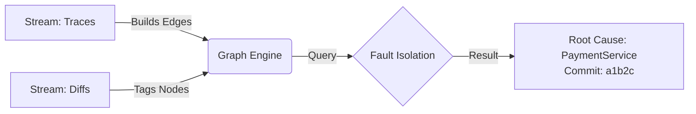

RootScout is an agentic system that automates the "investigation phase" of incident response. While standard tools (PagerDuty) only notify humans, and generic AIOps tools simply correlate metric spikes, RootScout acts as an "AI Engineer." It ingests telemetry (metrics, traces) and code changes (GitHub PRs) to build a real-time Causal Dependency Graph.
When an alert fires, the system:
- **Deductively Isolates:** Traverses the trace graph to mathematically pinpoint the failing node (e.g., "Service A is healthy, but waiting on Service B").
Agentic Investigation: A code-aware LLM agent then "logs into" that specific node, retrieves recent commits/logs, and formulates a hypothesis (e.g., "Latency spike matches the timestamp of the v2.1 deployment").
- **Resolution:** It generates a human-readable "Incident Brief" with the exact root cause and suggested rollback.
- **Stretch Goal:** A proactive "Auditor" module that analyzes historical alert patterns to identify "noisy" monitors and predict resource saturation (e.g., memory leaks) before outages occur.


# RootScout: Graph-Augmented RCA Agent 🕵️‍♂️

> **Project:** RootScout — Autonomous SRE Agent  
> **Component:** Causal Graph Engine + LLM Reasoning Layer (MVP)

RootScout is an agentic system designed to automate the high-toil "investigation phase" of incident response. While traditional tools like PagerDuty simply notify humans, and legacy AIOps tools merely correlate metric spikes, **RootScout acts as an AI SRE**. By ingesting real-time telemetry (traces) and version control data (GitHub PRs), it builds a **Causal Dependency Graph** to identify "Patient Zero" with deterministic precision.

---

## 1. The Core Intuition: "The Blueprint & The Detective"

In a complex distributed system, an alert in one service is often just a symptom of a failure elsewhere.

### The Problem
A fire alarm (Alert) goes off, but in a skyscraper with 50 floors, finding the source is slow.

### The RootScout Way
1. **The Blueprint (The Graph):** RootScout maintains a live "blueprint" of how services talk to each other. If the Kitchen alarm trips, but the gas line comes from the Basement, RootScout knows where to look first.
2. **The Investigation:** The agent ignores the Attic and Bedrooms. It zooms into the Basement (the dependency), retrieves the latest "maintenance logs" (GitHub Diffs), and identifies exactly which pipe (Commit) broke.

### Architecture Flow


```mermaid
graph LR
    A[Stream: Traces] -->|Builds Edges| C(Graph Engine)
    B[Stream: Diffs] -->|Tags Nodes| C
    C -->|Query| D{Fault Isolation}
    D -->|Result| E["Root Cause: PaymentService<br/>Commit: a1b2c"]
```

---

## 2. Technical Architecture

When an alert fires, the system executes a three-stage recovery pipeline:

1. **Deductive Isolation:** The `GraphBuilder` traverses the OTel trace graph to mathematically pinpoint the failing leaf node (e.g., "Service A is healthy, but waiting on Service B").

2. **Agentic Investigation:** A code-aware LLM agent (powered by Gemini 2.5 Flash) "logs into" the suspect node, analyzes recent logs/commits, and formulates a technical hypothesis.

3. **Resolution:** The agent generates a human-readable Incident Brief including the specific root cause and a suggested remediation command (e.g., `git revert` or `kubectl rollout undo`).

---

## 3. Getting Started

### Prerequisites

Before you begin, ensure you have:

1. **Python 3.9 or higher**
   ```bash
   python3 --version  # Should be 3.9+
   ```

2. **pip or uv** (for dependency management)
   ```bash
   pip --version
   ```

3. **Gemini API Key** (free tier available)
   - Get one from [Google AI Studio](https://aistudio.google.com/)
   - Click "Get API Key" → Create new key
   - Copy the key (starts with `AIza...`)

### Setup & Configuration

1. **Clone and setup:**
   ```bash
   git clone https://github.com/asthamohta/CS224G-SRE.git
   cd CS224G-SRE
   ```

2. **Install dependencies:**
   ```bash
   # Option 1: pip (recommended for quick start)
   pip install -r RootScout/requirements.txt

   # Option 2: uv (faster, recommended for teams)
   uv pip install -r RootScout/requirements.txt

   # Option 3: poetry (for dependency management)
   poetry install
   ```

3. **Configure API key:** Copy the example config and add your key:
   ```bash
   # Copy example config
   cp .env.example .env

   # Edit and add your Gemini API key
   # GEMINI_API_KEY=AIza...your_actual_key_here
   ```

   **Important:** The `WATCH_PATH_PREFIX=online_boutique` setting tells the GitHub ingester to only look at PRs that modify files in the `online_boutique/` folder. Change this if you want to watch a different folder.
### Quick Test (Optional)

Test individual components before running the full demo:

```bash
# View synthetic OTEL data
python show_synthetic_data.py

# Test OTEL ingester
python test_otel_ingester.py

# Test GitHub ingester
python test_github_ingester.py
```

### Run the Demo

Execute the complete RCA pipeline:

```bash
python demo.py
```

**The demo shows:**
1. OTEL data ingestion → builds service dependency graph
2. GitHub PR enrichment → correlates code changes
3. LLM-powered RCA → identifies root cause with remediation

**Output:** Full incident report with root cause analysis and suggested fix

---

## 4. Benchmark & Evaluation

RootScout ships with a benchmark suite that evaluates RCA quality using
[OpenRCA's](https://github.com/microsoft/OpenRCA) evaluation methodology
(component accuracy, reason accuracy, datetime accuracy).

### Install eval dependencies

```bash
pip install -r requirements_eval.txt
```

> This installs `pandas`, `sentence-transformers`, and `numpy` on top of the
> existing RootScout requirements. `sentence-transformers` enables semantic
> matching so LLM paraphrases score correctly.

### Run the benchmark (real Gemini, all 10 scenarios)

```bash
python eval/run_eval.py
```

Results are saved under `eval/results/` and a report is printed:

```
────────────────────────────────────────────────────────
Class         Total(#)      Correct(#)    Accuracy(%)
────────────────────────────────────────────────────────
easy          3             2             66.7%
medium        3             3             100.0%
hard          4             3             75.0%
────────────────────────────────────────────────────────
Total         10            8             80.0%
────────────────────────────────────────────────────────
```

### Other useful flags

```bash
# Fast smoke test with mock LLM (no API key needed)
python eval/run_eval.py --mock

# Run only a specific difficulty tier
python eval/run_eval.py --difficulty easy
python eval/run_eval.py --difficulty hard

# Re-score an existing predictions CSV without calling the LLM again
python eval/run_eval.py \
  --rescore eval/results/<run>_predictions.csv \
  --query   eval/results/<run>_query.csv
```

### Include real OpenRCA cases (optional subset, no 80 GB download needed)

Only the two small CSV files from OpenRCA are required (~KB each):

1. Open the [OpenRCA Google Drive](https://drive.google.com/drive/folders/1wGiEnu4OkWrjPxfx5ZTROnU37-5UDoPM)
2. Navigate to e.g. `Telecom/`
3. Download **only** `query.csv` and `record.csv`
4. Place them at `eval/openrca_data/Telecom/`

Then run with those cases appended:

```bash
python eval/run_eval.py --with-openrca --openrca-system Telecom --openrca-n 5
```

### What is being measured

Each scenario is scored on three criteria (same as OpenRCA):

| Criterion | Method | Weight |
|---|---|---|
| Root cause component | Exact string match | 1/3 |
| Root cause reason | Cosine similarity ≥ 0.50 (`all-MiniLM-L6-v2`) | 1/3 |
| Occurrence datetime | Within ±60 seconds of ground truth | 1/3 |

A scenario scores **1.0 (PASS)** only when all three criteria are met.
Partial scores (0.67, 0.33) indicate which criteria were missed.

### Scenario breakdown

| Task | Difficulty | Failure type |
|---|---|---|
| task_1 | easy | DB connection pool exhausted |
| task_2 | easy | OOM crash |
| task_3 | easy | Invalid API key |
| task_4 | medium | Upstream latency cascade |
| task_5 | medium | Shared DB overload |
| task_6 | medium | Kafka consumer crash |
| task_7 | hard | Bad data / red herring |
| task_8 | hard | Version regression (intermittent) |
| task_9 | hard | Stale config cache, multi-service |
| task_10 | hard | Rate-limiter misconfiguration |

---

## 5. Expected Demo Output

The simulation will stream trace data, identify the bottleneck, and trigger the Gemini-powered agent to provide a fix:

```plaintext
--- LLM SETUP ---
🔌 Connecting to Gemini API (2.5 Flash)...

--- STREAMING DATA START ---
[Graph] Updated dependency: frontend -> checkout_service
[Graph] Tagged payment_service with commit a1b2c3d_bad_commit
[Graph] Updated dependency: checkout_service -> payment_service
--- STREAMING FINISHED ---

🚨 ALERT received on: frontend
🔍 Retrieving Context Packet...

📡 Sending request to gemini-2.5-flash...

📋 FINAL INCIDENT REPORT
{
  "root_cause_service": "payment_service",
  "confidence": 0.98,
  "reasoning": "The frontend alert is a downstream symptom of a failure in the payment_service. Traces show an ERROR state with 5000ms latency immediately following deployment a1b2c3d_bad_commit.",
  "recommended_action": "git revert a1b2c3d_bad_commit"
}
```

### Detailed Output Breakdown

**Phase 1: Graph Construction**
- The system streams in trace data and builds the service dependency graph
- Each edge represents a service-to-service call
- Nodes are tagged with recent commit hashes from GitHub

**Phase 2: Fault Isolation**
- When an alert fires on `frontend`, the graph is traversed to find all downstream dependencies
- The system checks each service's health status and recent deployments
- `payment_service` is identified as the bottleneck with ERROR state

**Phase 3: LLM Investigation**
- The Gemini agent receives a context packet containing the suspect service, recent commits, and trace data
- It generates a hypothesis explaining the causal chain
- A remediation action is suggested with high confidence

---
