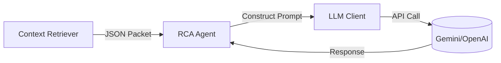

# LLM Integration Guide 🧠

This directory contains the scaffolding for integrating real Large Language Models (LLMs) into the RootScout Oncall Agent.

## Overview

The `RCAAgent` (in `../graph/agent.py`) is currently using a **Mock Client**. To productionize this, we need to replace the mock with a real client that talks to Gemini, OpenAI, or Anthropic.

## Architecture



## How to Implement

1.  **Environment Setup**:
    - Store API keys in `.env` (add to `.gitignore`).
    - `export GEMINI_API_KEY=...`

2.  **Client Implementation**:
    - Use the `LLMClient` abstract base class in `client.py`.
    - Implement `GeminiClient` or `OpenAIClient`.

3.  **Prompt Engineering**:
    - The prompt is currently hardcoded in `agent.py`.
    - **Improvement**: Move prompts to `prompts.yaml` or a versioned prompt management system.
    - **Strategy**: Use "Chain of Thought" (CoT) prompting. Ask the model to "Think step-by-step" before delivering the verdict.

## Example Usage

```python
from llm_integration.client import GeminiClient

client = GeminiClient(api_key="...")
response = client.generate_content(prompt)
```

## Advanced: Function Calling

Instead of just returning text, you can use **Function Calling** (Tool Use) to let the Agent ask for more data *during* the investigation.

*   **Tool**: `get_pod_logs(service_name, lines=100)`
*   **Tool**: `diff_commit(commit_sha)`

If the LLM says "I need logs for PaymentService", the system should execute that tool and feed the result back to the LLM.
