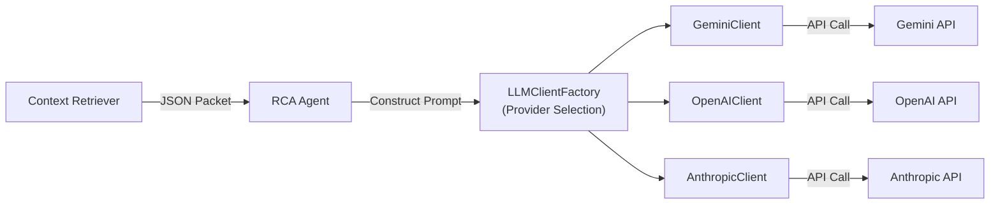

# LLM Integration Guide 🧠

This directory contains the implementation for integrating real Large Language Models (LLMs) into the RootScout RCA Agent.

## Overview

The `RCAAgent` (in `../graph/agent.py`) uses a pluggable LLM client interface. The system supports multiple LLM providers:
- **Gemini** (Google AI Studio)
- **OpenAI** (ChatGPT, GPT-4)
- **Anthropic** (Claude)
- **Mock** (Testing/offline)

## Architecture


```mermaid
graph LR
    ContextRetriever[Context Retriever] -->|JSON Packet| Agent[RCA Agent]
    Agent -->|Construct Prompt| Factory["LLMClientFactory<br/>(Provider Selection)"]
    Factory --> Gemini["GeminiClient"]
    Factory --> OpenAI["OpenAIClient"]
    Factory --> Anthropic["AnthropicClient"]
    Gemini -->|API Call| GeminiAPI["Gemini API"]
    OpenAI -->|API Call| OpenAIAPI["OpenAI API"]
    Anthropic -->|API Call| AnthropicAPI["Anthropic API"]
```

## Quick Start

### 1. Set Up Your Environment

Copy the example config and add your API key:
```bash
cp .env.example .env
```

Edit `.env` and add your chosen provider:

**Option A: Gemini (Free tier)**
```env
LLM_PROVIDER=gemini
GEMINI_API_KEY=AIza...your_key_here
```

**Option B: OpenAI**
```env
LLM_PROVIDER=openai
OPENAI_API_KEY=sk-...your_key_here
OPENAI_MODEL=gpt-4-turbo
```

**Option C: Anthropic**
```env
LLM_PROVIDER=anthropic
ANTHROPIC_API_KEY=sk-ant-...your_key_here
ANTHROPIC_MODEL=claude-3-5-sonnet-20241022
```

### 2. Install Required Package

```bash
# For Gemini
pip install google-genai

# For OpenAI
pip install openai

# For Anthropic
pip install anthropic

# Or install all at once
pip install google-genai openai anthropic
```

### 3. Run with Your LLM

The system will automatically use your configured provider:

```bash
python demo.py
python graph/run_simulation.py
```

## Supported Providers

### Gemini (Google)
- **Models**: `gemini-2.5-flash` (default)
- **Free Tier**: Yes
- **Cost**: Pay-as-you-go
- **Setup**: [Google AI Studio](https://aistudio.google.com/)
- **Env Vars**: `GEMINI_API_KEY`, `GEMINI_MODEL` (optional)

### OpenAI
- **Models**: `gpt-4-turbo`, `gpt-4`, `gpt-3.5-turbo`
- **Free Tier**: Limited trial credits
- **Cost**: Token-based pricing
- **Setup**: [OpenAI Platform](https://platform.openai.com/api-keys)
- **Env Vars**: `OPENAI_API_KEY`, `OPENAI_MODEL` (optional)

### Anthropic
- **Models**: `claude-3-5-sonnet-20241022`, `claude-3-opus-20240229`
- **Free Tier**: No
- **Cost**: Token-based pricing
- **Setup**: [Anthropic Console](https://console.anthropic.com/)
- **Env Vars**: `ANTHROPIC_API_KEY`, `ANTHROPIC_MODEL` (optional)

### Mock (Testing)
- **Models**: Mock
- **Cost**: Free
- **Use Case**: Testing without API calls
- **How to enable**: `LLMClientFactory.create()` falls back to MockClient on any error

## Usage in Code

### Using the Factory Pattern (Recommended)

```python
from llm_integration.client import LLMClientFactory, MockClient

try:
    # Automatically reads LLM_PROVIDER from .env
    client = LLMClientFactory.create()
except Exception as e:
    # Fallback to mock for testing
    client = MockClient()

response = client.generate_content(prompt)
```

### Direct Instantiation

```python
from llm_integration.client import GeminiClient, OpenAIClient, AnthropicClient

# Gemini
gemini = GeminiClient()  # Reads GEMINI_API_KEY from .env
gemini = GeminiClient(api_key="...")  # Or pass explicitly

# OpenAI
openai = OpenAIClient()  # Reads OPENAI_API_KEY from .env
openai = OpenAIClient(api_key="...", model="gpt-4")

# Anthropic
anthropic = AnthropicClient()  # Reads ANTHROPIC_API_KEY from .env
anthropic = AnthropicClient(api_key="...", model="claude-3-opus-20240229")
```

## Advanced: Function Calling (Future)

The abstraction supports extending to Function Calling (Tool Use) for multi-step investigations:

```python
class LLMClient(abc.ABC):
    @abc.abstractmethod
    def generate_content(self, prompt: str) -> str:
        pass
    
    def call_function(self, function_name: str, args: dict) -> Any:
        # Future: Let LLM request more data
        pass
```

**Example tools**:
- `get_pod_logs(service_name, lines=100)`
- `diff_commit(commit_sha)`
- `query_metrics(service_name, metric_name, time_range)`

If the LLM says "I need logs for PaymentService", the system can execute that tool and feed results back.

## Troubleshooting

### Missing API Key
```
❌ No Gemini API Key found. Check your .env file.
```
Solution: Copy `.env.example` to `.env` and add your API key.

### Package Not Installed
```
❌ OpenAI SDK not installed. Run: pip install openai
```
Solution: Install the required package for your chosen provider.

### Unknown Provider
```
❌ Unknown LLM provider: xxx. Supported: gemini, openai, anthropic
```
Solution: Check `LLM_PROVIDER` in `.env` against supported list.

### API Call Failed
```
Error: Invalid API key provided
```
Solution: Verify your API key is correct and has necessary permissions.
